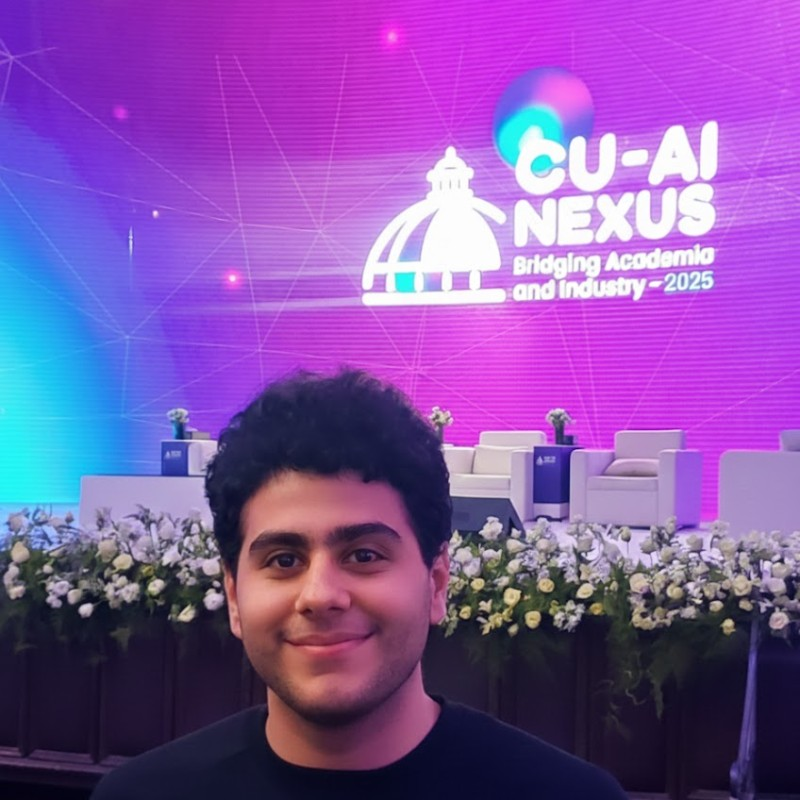

  

  
   
   
  
  
  
  

 

<h3 align="center">💫 About Me</h3>

 🎓 <b>Computer Science Student</b> at Cairo University specializing in <b>Artificial Intelligence</b>. 
 I bridge the gap between complex algorithms and real-world applications. 
 🔭 Currently working on <b>Machine Learning Models & System Design</b>.

<h3 align="center">🛠️ Technical Arsenal</h3>

 

 

---

<h3 align="center">📊 GitHub Analytics</h3>

  <table>
    <tr>
      <td>
        
      </td>
      <td>
        
      </td>
    </tr>
  </table>
   
  

<h3 align="center">🐍 Contributions Snake</h3>

  <picture>
    <source media="(prefers-color-scheme: dark)" srcset="https://raw.githubusercontent.com/itz-youssef/itz-youssef/output/github-snake-dark.svg" />
    <source media="(prefers-color-scheme: light)" srcset="https://raw.githubusercontent.com/itz-youssef/itz-youssef/output/github-snake.svg" />
    
  </picture>

<h3 align="center">🏆 Achievements</h3>

  

---

  
  

  
<i>"The best way to predict the future is to invent it."</i>

